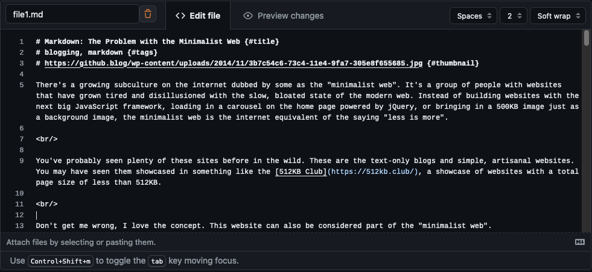
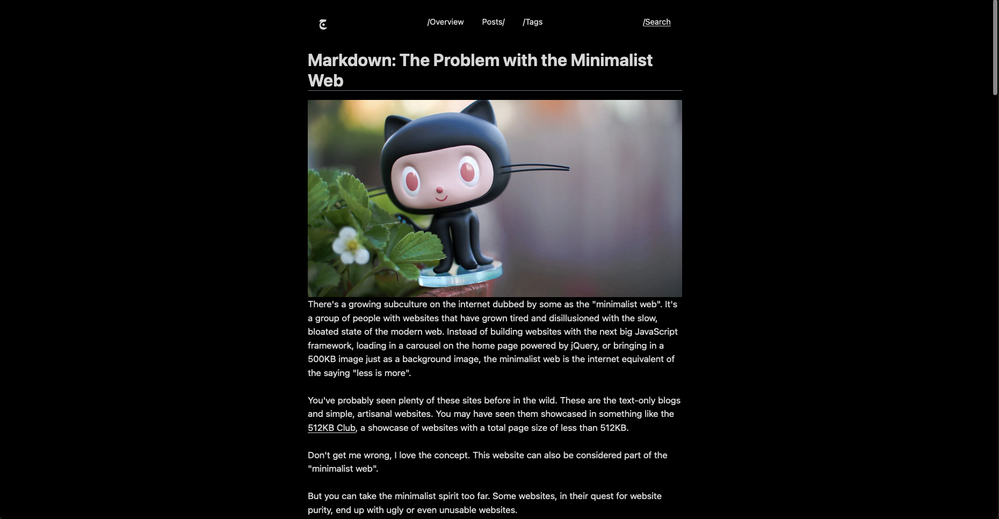

> Still under development and currently offline.

### jawhar - جوهر

Gist-based blogging system. Create gists and view them in a blog-like format at [jawhar.samisul.com](https://jawhar.samisul.com)

#### Demo

##### Example of a blog post (file under the jawhar gist)
   

#### The result is the following blog post at `jawhar.samisul.com/posts/<username>/<post title>`


#### Usage

- Create a gist with the description `jawhar`
- Add files with the extension `.md` to the gist
- The files should have the following format:

> posts marked with `true {#draft}` will not be shown

```markdown
# TITLE HERE {#title}
# tag1, tag2 {#tags}
# link to image {#thumbnail}
# true {#draft}

CONTENT HERE
```

- Visit [jawhar.samisul.com](https://jawhar.samisul.com)
- Search for username (try `samisul` for a demo)

#### Features

- [x] View Posts/Post
- [x] Search Posts
- [x] View Posts by Tag

> jawhar - جَوْهَر: essense aka gist
